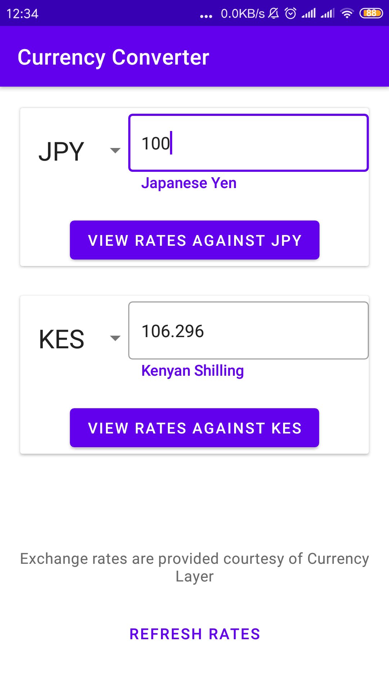
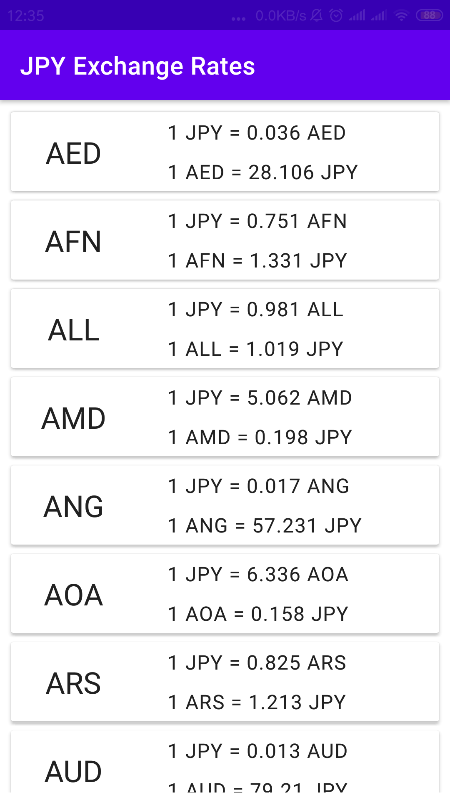

# PayPay Interview Code Challenge

This project is my submission for the coding challenge as part of PayPay's interview process.

## Goal:
* Develop a Currency Conversion App that allows a user view exchange rates for any given currency

## Functional requirements:

- [x] Exchange rates must be fetched from: https://currencylayer.com/documentation
- [x] Use free API Access Key for using the API
- [x] User must be able to select a currency from a list of currencies provided by the API
- [x] User must be able to enter desired amount for selected currency
- [x] User should then see a list of exchange rates for the selected currency
- [x] Rates should be persisted locally and refreshed no more frequently than every 30 minutes (to limit bandwidth usage)

## Limitations
1. The Free API access limits calls to only http protocol.
2. USD is the only source currency supported to fetch rates against.

To overcome limitation 2, and allow for converting from one currency to another, I calculated this locally based on the respective currencies' rates against the USD.

## Architecture
The app follows MVVM architecture with a general overview as seen below.

[Image Source](https://developer.android.com/topic/libraries/architecture/images/final-architecture.png)

## Libraries

Libraries used in the application include:

* [Jetpack](https://developer.android.com/jetpack) - Feature rich code development with reduced boilerplate
  - Databinding
  - Lifecycle
  - Navigation
  - Room
* [Retrofit](https://github.com/square/retrofit)
* [Moshi](https://github.com/square/moshi)
* [Hilt](https://developer.android.com/training/dependency-injection/hilt-android)
* [EasyPrefs](https://github.com/Pixplicity/EasyPrefs)

## Screenshots

